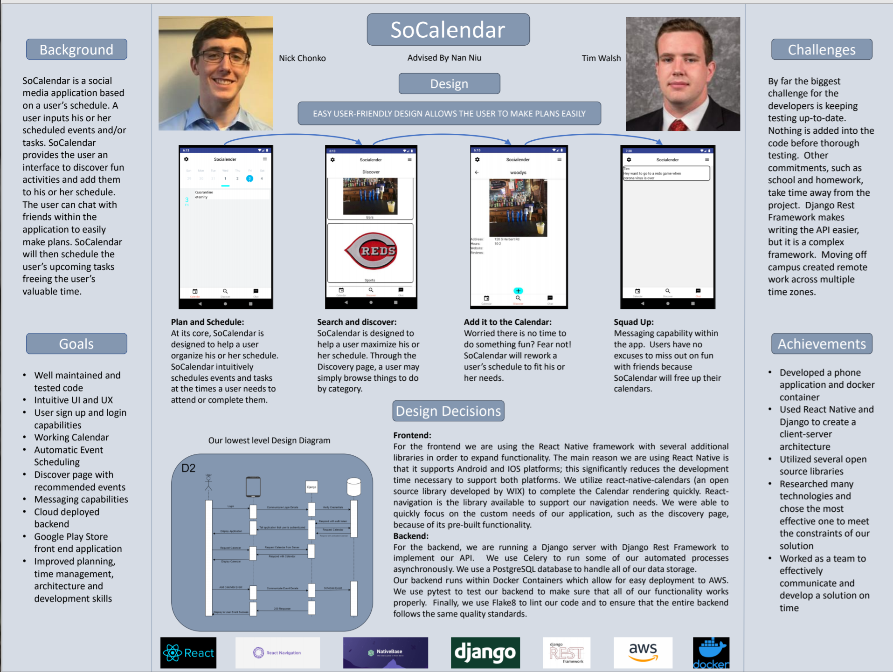

# Table of Contents
 - [Project Description](#project-description)
 - [User Interface Specification](#user-interface-specification)
 - [Test Plan and Results](#test-plan-and-results)
 - [User Manual](#user-manual)
 - [Spring Final PPT Presentation](#spring-final-ppt-presentation)
 - [Final Expo Poster](#final-expo-poster)
 - [Assessments](#assessments)
    - [Fall Self-Assessments](#fall-self-assessments)
    - [Spring Self-Assessments](#spring-self-assessments)
 - [Summary of Hours](#summary-of-hours)

# Project Description
SoCalendar is a social
media application based
on a user’s schedule. A
user inputs his or her
scheduled events and/or
tasks. SoCalendar
provides the user an
interface to discover fun
activities and add them
to his or her schedule.
The user can chat with
friends within the
application to easily
make plans. SoCalendar
will then schedule the
user’s upcoming tasks
freeing the user’s
valuable time.

# User Interface Specification
The application is laid out with a simplistic 3 tab design, within these 3 tabs a user is able to use most of the applications functionality. 2 additional menu screens exist so the user is able to alter account and application settings, however at this time the these menus are not fully built out. Within each tab multiple screens exist on a stack to allow users to easily navigate throughout specific functionalities of the application.

# Test Plan and Results
*See the full test plan file [here](https://gitlab.com/jebidis93/senior-design-planning/-/blob/master/ASSN_3.pptx)*
In the backend, our main testing strategy is to make unit tests for almost
everything we write. We have installed pytest as our testing framework. The
backend uses a test database that is used when tests are run and all artifacts
from testing are completely removed between every test.

In the frontend, our plan is to test core UI/UX functionality. This will mean
simple front end navigation tests as well as in-def end to end test for getting
results from the back end.

# User Manual
*See the full manual [here](https://gitlab.com/jebidis93/senior-design-planning/-/wikis/home)*

# Spring Final PPT Presentation
*See the full presentation [here](https://gitlab.com/jebidis93/senior-design-planning/-/blob/master/ASSN_3.pptx)*

# Final Expo Poster
*See the final poster file [here](https://gitlab.com/jebidis93/senior-design-planning/-/blob/master/Poster_Final.pdf)*

# Assessments

## Fall Self-Assessments
### Nick
Our Senior Design project is a social media application.  Our main focus at the
moment is on event scheduling.  One of the main drives behind this project is
that we want a way to have adaptive scheduling for certain events.  For
instance, if I have a homework assignment due in a week, the application would
be able to automatically allot times throughout the week around events that
cannot change, such as class meeting times.  These events could also be given
priority over other similar events, such as due dates.  We also want users to be
able coordinate these events to fit each of their time needs.

Some classes here at UC will help me to complete this project.  CS4092, or
Database Design, and CS 5151, or Database theory should help me with some of my
backend design.  Last semester of school I took EECE3093C, or Software
Engineering.  This class helped me to learn some of the software engineering
process and will definitely help with the project overall.  I am currently
enrolled in CS 5127, or Requirements Engineering.  While the class has only just
begun, it is already helping me to understand how to quantify stakeholder’s
needs.

My co-ops will also help me in our Senior Design project.  I worked at Tenet 3
in Dayton Ohio for all of my co-op rotations.  My title was intern for all
rotations.  Most of my experience was with back-end work, but I do have some
front-end experience.  Because I am probably going to do most of our project’s
backend, this should help me quite a bit.  Another skill that I have developed
from co-op is good planning.  Once I was able to see the proper direction that
our work projects were heading, I was able to assist in planning for the future
of the projects consistently.

One of the reasons that I am excited for this project, is that me and my group
have had some of the main ideas for the project in our minds since sophomore
year.  Namely, the automatic scheduling portion of the project.  Our main
approach to the project, firstly, is going to be getting a baseline application
working.  Then we will proceed with the calendar functionality. Next we will get
some more social media functionality.  Throughout most of the process, we hope
to have some users involved for both test data, as well as feedback.  This of
course, is only a rough outline of our approach as user feedback and bumps along
the way could change our course.

The expected results are a working application, with the scheduling capabilities
described above, and in our project description.  We also want the users to be
able to sync their calendars and schedule events together.  Finally, we hope to 
be able to make changes that our test users suggest throughout their time
testing out the application – whatever their feedback might be.  I think that I
will feel we are “done” when we can meet all the functionality that our group
wants to accomplish.  However, I put “done” in quotes because user feedback
might mean we are never truly finished, as there may always be user requested
functionality that we do not yet have.  Similarly, I think that we will know if
we have done a good job based on test user feedback.

### Tim
For our senior design project, we are making a self-scheduling calendar. This
calendar will also include a social media aspect that allows users to easily
plan things to do with friends. There are other products out there that help
users schedule their lives automatically. However, they do not have the social
aspects that our application will. This project will allow our team to expand
our knowledge and understanding of many technologies, such as Google Calendar
and Reactjs. The project will focus on developing our skills application and
cloud development.

Throughout my college experience I have learned a lot that will help me with
developing this application. From classes I have learned important concepts from
my networking, requirements engineering and python courses. Networking will be
applied when we connect the application to the server securely. Requirements
engineering has taught me the skills necessary to come up with a proper project
plan, which will help us work efficiently. Python will help us develop the
back-end server and allow us to easily and securely communicate with our
database and Google. There are other things that I have learned from courses
like Algorithms and Artificial Intelligence that I am sure will be used, but we
have not determined how at this moment.

More importantly then our course work I have learned a lot during my CO-OP
experiences. I have developed so many skills from CO-OP that will help with this
project and it would be impossible to discuss them all. At Siemens I learned the
fundamentals of full stack development and software analytics. The skills I
learned at Siemens which will help me develop a good user interface and
experience. At DFIN I worked in cloud development and honed my skill in full
stack development. The skills I learned at DFIN will help us create and
effective and working back end.

Not only is this project something that I believe in, but it is an excellent
opportunity to test my skills, challenge myself and learn some new things along
the way. Theis projects origins come from an idea that I had 5 or 6 years ago
now. I have done a few basic self-scheduling calendars since I had the idea, but
I know that we can make a massive improvement to the earlier versions. The
addition of the social media aspect to this application is what truly excites
me. I genuinely believe that this application could be popular if executed
properly. It will be difficult, but I really think that we can make something
great.

## Spring Self-Assessments
### Nick
For my individual contribution, I wrote the back end to our assignment.  I made
a Django server running in a Docker container with the idea that it would make
deploying to the cloud easier.  I was able to learn more about Django, Django
Rest Framework, and Docker, which were my biggest goals with this project.  I
have worked with all three at Co-op, but was never able until now to do the
actual set up for these things, so in that sense, I have accomplished my goal.

By far, my biggest success was with the automatic event scheduling.  Our project
is based around planning events in a calendar, and one of the features of our
project is that users are able to add things they need to do, and have our
backend plan these out for them where their schedule permits.  Many hours went
into the algorithm between writing, refactoring, and testing.  The algorithm is
not to the point where I wish it were, but I happy with the point it is
currently at.  I believe that our biggest obstacle was our own ambition.  We had
much grander plans for our project as a whole, but were not able to complete
many of them.  The biggest problem was because there are only two of us in the
group, and we have other commitments.  If I did not have other classes, for
example, and were able to work on the project as if I were at work, I would be
able to get the majority of the planned backend finished on my own.

### Tim
My primary development responsibilities for this project was to develop the
front end of a phone application. Other than that Nick and I split the work when
it came to documentation and architecting communication between the phone and
server. At the beginning of this project my goal was to improve my front-end
development skill with React-Native. I had gotten minimal experience throughout
my CO-OPs developing front ends, so this was so this was a really intriguing
process for me. 

I got to plan, layout and design the entire front facing application for this
project, to do this I had to consider visual appeal and functional ease. I went
through a number of design iterations and was constantly evolving things. I made
the mistake of designing screens before laying out navigation, which I learned
doing navigation first would have saved me a lot of headaches. I also made the
mistake of using some libraries which didn’t provide benefits to me in the long
run I then had to cut them out of the code base and rewrite their functionality.
Rewriting the functionality served to benefit my skills and the application
worked better, however this took a lot of time and lead to me not finishing some
features that I wanted.

# Summary of Hours and Justification
## Nick
## Tim
### Justification of Hours
Nick and split the work on the documentation assignments as best we could in order to give each other as much development time as possible, but one of my major time consumers was rendering mock up screens for assignments in order to provide more clarity to what we were writing. Other than that I spent a lot of time researching and developing the front end. I am not traditionally a front end developer so things took me a lot of time and I did a lot of learning in this area.
### Second Semester
| Task |	Description | Hours |
|---|---|:---|
|Render Screens for assignments|	This task is for the time spent rendering dummy screens to be used in assignments. This includes highlighting features for the purpose of the assignment|	5|
|User Manual	|For this assignment I had to create a wiki on how the application works|	3
|Final Poster	|My part in the writing, editing and design	|4|
|Front End Video	|I created a ~10 minute video about the front end for the expo|	1|
|Other assignments	|Assignments that are not listed|	3|
Develop Calendar Screens	|This task represents developing the looks and functionality for the screens withing the Calendar Tab of the application	|7|
Develop Discover Screens|	This task represents developing the looks and functionality for the screens withing the Discover Tab of the application|	10
Develop Message Screens	|This task represents developing the looks and functionality for the screens withing the Message Tab of the application	|4
Application Navigation	|As stated in my final assessment I wish I had done this first, it was hard to do in the first place and even harder to intigrate after the fact|	8
Login/Signup screens	|We had a bunch of issues at the end of the project with our authorization protocols and these were quite difficult to get working|	7
Connect To Back End	|I was unable to install docker for windows on my machine and had several problems getting docker toolbox running, which was necessary to connect the application	|5

### First Semester 
|Task	|Description|	Hours|
|---|---|:--|
Rough UI|	Created initial 3 screens for the application with rough layout|	15
Rough UX|	Created controls and routing between the 3 initial screens	|10
Research	|Researched apis and authentication|10
Various assignments|	Class required assignments	|10
